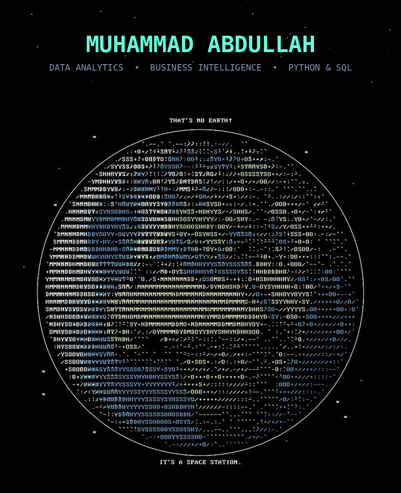

<!--
=====================================================================
 HOW TO KEEP THIS README UP TO DATE
=====================================================================
 🧰  ADD A NEW SKILL       → Ctrl+F "ADD A NEW SKILL"
 🚀  ADD A NEW PROJECT     → Ctrl+F "ADD A NEW PROJECT"
 Each marker has a ready-made template right under it —
 copy the template, paste it, edit the details. That's it.

 Header banner image: this repo needs a file at assets/header-banner.png
 (the Earth / space-station artwork with your name on it). Upload it to
 that exact path and the banner below will render.
=====================================================================
-->

 

  
  
  
  
  
  

 

## 📊 About Me

<table width="100%">
<tr>
<td align="center" width="25%">
<b>🎓 Role</b> Data Analytics Student
</td>
<td align="center" width="25%">
<b>🧭 Focus</b> Business Intelligence & Visualization
</td>
<td align="center" width="25%">
<b>🛠️ Building</b> FinSight · StorePro
</td>
<td align="center" width="25%">
<b>📍 Status</b> Open to Opportunities
</td>
</tr>
</table>

I'm a Data Analytics student who enjoys turning messy, raw data into dashboards and stories that actually drive decisions. My work sits at the intersection of **Python, SQL, and Power BI** — from cleaning and modeling data to building interactive dashboards that surface real business insight.

- 🔍 Currently sharpening skills in **advanced SQL, DAX, and data storytelling**
- 📈 Passionate about **KPI design, financial analytics, and dashboard UX**
- 🧩 I like projects that go end-to-end: raw data → pipeline → dashboard → insight
- 🤝 Open to internships and collaborative data projects

 

## 🧰 Tech Stack

<table width="100%">
<tr><td valign="top" width="50%">

**Languages & Querying**

</td><td valign="top" width="50%">

**BI & Visualization**

</td></tr>
<tr><td valign="top" width="50%">

**Data Analysis**

</td><td valign="top" width="50%">

**Tools & Workflow**

</td></tr>
</table>

<!-- 🧰 ADD A NEW SKILL
   Copy the two lines below into any cell above (or start a new <tr><td valign="top" width="50%"> ... </td></tr> row
   for a new category), then edit the skill name, percentage, and logo.
   Find logo names at https://simpleicons.org

-->

 

## 📈 GitHub Analytics

<table width="100%">
<tr>
<td width="50%">

</td>
<td width="50%">

</td>
</tr>
</table>

 

## 🗺️ Learning Roadmap

**Legend:** ✅ Completed &nbsp;·&nbsp; 🔄 In Progress &nbsp;·&nbsp; ⏳ Planned

| Milestone | Area | Status |
|---|---|:---:|
| Python Fundamentals & Pandas/NumPy | Data Analysis | ✅ |
| SQL for Data Analysis (Joins, CTEs, Subqueries) | Querying | ✅ |
| Power BI — Data Modeling & DAX Basics | BI & Visualization | ✅ |
| End-to-End Analytics Project (FinSight) | Applied Project | ✅ |
| Advanced DAX & Power BI Performance Tuning | BI & Visualization | 🔄 |
| Data Warehousing Concepts (Star Schema, ETL) | Data Engineering | 🔄 |
| Statistics for Analytics | Foundations | 🔄 |
| Machine Learning Basics for Analysts | Predictive Analytics | ⏳ |
| Cloud Data Tools (Azure / AWS Basics) | Cloud & Data | ⏳ |

 

## 🚀 Featured Projects

<table width="100%">
<tr>
<td width="50%" valign="top">

**📊 FinSight — Personal Financial Intelligence Dashboard**

| | |
|---|---|
| **Type** | Data Analytics & BI Dashboard |
| **Tools** | Python, Pandas, NumPy, Matplotlib, Power BI, Excel |
| **Data Source** | Kaggle — 100,000+ financial transaction records |
| **Highlight** | End-to-end pipeline: data cleaning → feature engineering → KPI development → fraud analysis → interactive Power BI dashboard |

**[→ View Repository](https://github.com/itsabdullah6/FinSight)**

</td>
<td width="50%" valign="top">

**🛒 StorePro — Store Management System**

| | |
|---|---|
| **Type** | Desktop Application |
| **Tools** | Python, Tkinter, JSON, OpenPyXL, Excel |
| **Data Source** | Self-managed inventory (JSON & Excel) |
| **Highlight** | Full store management system — inventory tracking, shopping cart, automated billing, receipt generation, interactive GUI with Excel integration |

**[→ View Repository](https://github.com/itsabdullah6/StorePro)**

</td>
</tr>
</table>

<!-- 🚀 ADD A NEW PROJECT
   Copy the whole template block below, paste it as a new <td> (for a 3rd project alongside FinSight/StorePro,
   just add it inside a NEW <tr>...</tr> since the current row already holds two), then edit:
   repo=YOUR_REPO_NAME in the pin-card URL, the title, the details table, the tool badges, and the repo link.

<tr>
<td width="50%" valign="top">

**🆕 Project Title — Short Tagline**

| | |
|---|---|
| **Type** | e.g. Data Analytics Dashboard |
| **Tools** | e.g. Python, SQL, Power BI |
| **Data Source** | Where the data came from |
| **Highlight** | The standout feature, in a line or two |

**[→ View Repository](https://github.com/itsabdullah6/YOUR_REPO_NAME)**

</td>
</tr>

-->

 

## 🔧 Currently Building

- 📈 Expanding **FinSight** with deeper fraud-detection analysis and additional KPI drill-downs
- 🧾 Iterating on **StorePro**, refining the GUI and adding sales-trend reporting
- 📚 Practicing advanced **DAX** and data modeling patterns in Power BI
- 🗃️ Exploring **data warehousing** and ETL fundamentals to strengthen pipeline design

 

## 📬 Connect With Me

Thanks for stopping by — let's turn data into decisions. 📊

